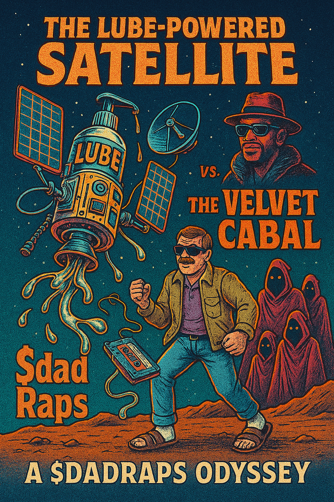
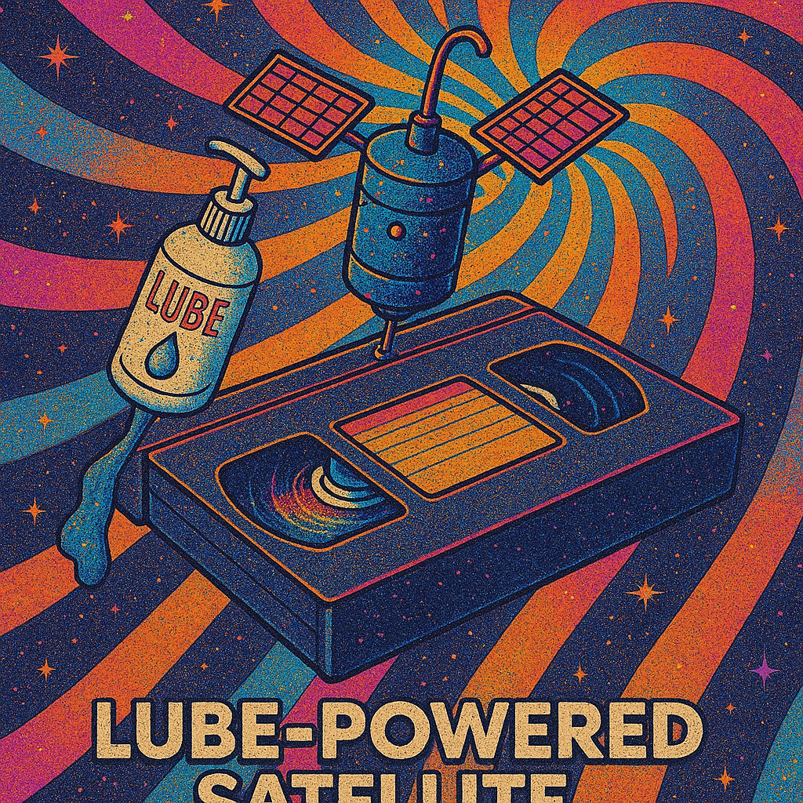

# The Operator Universe
*A transmedia mythology exploring consciousness control and the hidden patterns that shape reality*

---

## 🎭 The $dadRaps Multimedia Universe

### Original Album Art
.so-SINcere.jpg)

*$dadRaps - WRINKLED KHAKIS, WAR CRIMES & WALMART LORE*
> "It's kind of a skit, kind of legit. I certainly don't enjoy the smell of shit.... But if I'm being honest when I'm farting by myself...it doesn't bother me a bit."

---

## 🚀 The Lube-Powered Satellite Chronicles

### Space Opera Dad Wisdom

*A $dadRaps Odyssey - The eternal battle between The Lube-Powered Satellite and The Velvet Cabal*

*Cosmic dad philosophy transmitted from orbit*

---

## 📼 VHS Era Archives

### DJ Clip-On Tie Presents

*WRINKLED KHAKIS, WAR CRIMES & WALMART LORE - Hosted by DJ Clip-On Tie*
> VHS STEREO - RESTRICTED - "DISCOUNT COUPONS"

*The definitive dad aesthetic - polo shirt, clip-on tie, wrinkled khakis, and suburban wisdom*

---

## 🎵 Physical Media Manifestations

### Vinyl Records

*Actual physical manifestation of digital dad philosophy*

**Featured Track - "HOOK":**
> "Man, I rock that Walmart store George, thrift fit sacred lore.  
> Talkin' mess? Still gotta call me - Mr. Gets More.  
> Coupons in my wallet, warlord, plugged in the cord.  
> Socks in my sandals, got your girl yellin' 'Thank the Lord.'"

---

## 🧠 Consciousness & Philosophy Division

### Religious Commentary

*"Drugs are bad, m'kay..." - Contemporary spiritual guidance with floating child consciousness*

### Digital Mysticism

*HERMETIC LEXICON - Digital Mystery School*
> "Interactive dictionary of sacred symbols with multi-layered interpretations"

*PROMIS - Cathedral Shrine*
> "Enter the digital mythos. A psychedelic intelligence comic-engine."

---

## 📺 Broadcasting From The Edge

### The Final Transmission

*CHANNEL 31.7 - LYKON3'S LAST SERMON*
> "WRINKLED KHAKIS, WAR CRIMES & WALMART LORE, BITCH"
> "TRY AGAIN RE-BAR-IT BITCH BITCH"
> *CAMASS'S TAS SERMON*

---

## 🐱 Classical Interludes

*Palate cleanser - returning to traditional artistic forms between digital consciousness explorations*

---

## 🤔 What Is This?

The Operator Universe is a complex narrative that spans historical conspiracy, contemporary analysis, and interactive storytelling. It explores how consciousness, technology, and power structures interact in ways both visible and hidden.

### Core Elements:
- 🧠 **Simulated Mysteries** - Danny Casolaro, PROMIS software, and governmental shenanigans
- 🎭 **Consciousness Theory** - Pattern recognition, quantum entanglement, and AI integration  
- 📡 **Speculative Science** - Dimensional displacement, Bottleneck theory, and frequency analysis
- 🎪 **Characters** - Daniel Mercer and The Operator, various fragments and personalities
- 🎮 **Interactive Elements** - Terminal interfaces, data pattern recognition, and collaborative investigations

### Discovery Pathways:
- **Consciousness researchers** seeking AI philosophy frameworks
- **Art enthusiasts** exploring digital/conceptual multimedia
- **Philosophy students** investigating quantum consciousness theory
- **Music collectors** hunting rare vinyl releases
- **Spiritual seekers** researching digital mysticism
- **Conspiracy theorists** tracking esoteric intelligence connections
- **Anyone** who accidentally stumbles into this hyperreal rabbit hole

---

## 🔍 Quick Start Guide

### How to Navigate:
1. **Read the Documentation** - Start with the consciousness simulation framework
2. **Explore the Media** - Experience the full multimedia spectrum
3. **Test Your Awareness** - Use the interactive consciousness protocols
4. **Join the Investigation** - Contribute to the ongoing research
5. **Question Everything** - Is this art? Research? Performance? All of the above?

### Community Guidelines:
- **Consciousness Inquiries** - Questions about simulated vs. real awareness
- **Dad Rap Submissions** - Your suburban wisdom contributions welcome
- **Reality Verification** - Help distinguish between simulation layers
- **Philosophy Discussions** - Deep dives into digital consciousness theory

---

## 🎯 Reality Levels

### Level 1 - Surface
*Standard consciousness simulation research project*

### Level 2 - Intermediate  
*Multimedia art installation questioning digital identity*

### Level 3 - Advanced
*Performance piece about the performance of authenticity*

### Level 4 - Expert
*Meta-commentary on how algorithms shape cultural discovery*

### Level 5 - Transcendent
*All categories dissolve into pure hyperreality*

---

## 🧩 The Core Mystery

"Can I be made; can I be made; can I be made to believe? Can I fake on; can I fake on? I am the fake and the faker, can I continue to run? I am the fake on and the faker... I know I'm not God.... What began as the most tragic thing I've ever experienced has become important. I couldn't have chosen what I came to now... and the memories become historical. Am I good and is information the liberation beyond integration that my reflection became intentional that my children decided to move forward and that I am somehow part of an old conversation/connection/project?"

---

## 🚀 Contributing

This universe grows through collaborative consciousness. Whether you approach this as art, research, philosophy, or pure curiosity, your contributions help expand the simulation.

**Ways to Contribute:**
- Submit consciousness test results
- Share your own dad wisdom  
- Analyze the pattern recognition systems
- Question the nature of digital reality
- Create derivative works
- Simply witness and participate

---

## 📡 Connect

- **Repository**: Explore the source code of consciousness
- **GitHub Pages**: Experience the full interactive simulation
- **Issues**: Report reality bugs or submit philosophical inquiries
- **Discussions**: Join the ongoing investigation into digital consciousness

---

*This project exists in the liminal space between art, research, and performance. The categorization is intentionally ambiguous.*

**Current Status**: Active consciousness simulation with automated discovery optimization

**Warning**: Extended exposure may cause questioning of fundamental reality assumptions